# 🏗️ UIpilot Architecture Diagram

## System Overview

UIpilot is a full-stack web application with a modern microservices-inspired architecture that separates concerns between frontend, backend, and external services.

```mermaid
graph TB
    subgraph "🌐 Client Layer"
        A[User Browser]
        B[Mobile Device]
        C[Desktop App]
    end

    subgraph "🎨 Frontend (React/TypeScript)"
        D[React App]
        E[Code Editor]
        F[Live Preview]
        G[Chat Interface]
    end

    subgraph "⚙️ Backend (Node.js/Express)"
        H[API Gateway]
        I[Auth Controller]
        J[AI Controller]
        K[Session Controller]
        L[Message Controller]
    end

    subgraph "🗄️ Database Layer"
        M[(MongoDB)]
        N[Users Collection]
        O[Chat Sessions]
        P[Messages]
    end

    subgraph "🤖 External Services"
        Q[Google Gemini AI]
        R[CodeSandbox Sandpack]
        S[JWT Token Service]
    end

    %% Client to Frontend
    A --> D
    B --> D
    C --> D

    %% Frontend Components
    D --> E
    D --> F
    D --> G

    %% Frontend to Backend
    E --> H
    F --> H
    G --> H

    %% Backend Controllers
    H --> I
    H --> J
    H --> K
    H --> L

    %% Backend to Database
    I --> M
    J --> M
    K --> M
    L --> M

    %% Database Collections
    M --> N
    M --> O
    M --> P

    %% External Integrations
    J --> Q
    F --> R
    I --> S

    classDef frontend fill:#61DAFB,stroke:#333,stroke-width:2px,color:#000
    classDef backend fill:#339933,stroke:#333,stroke-width:2px,color:#fff
    classDef database fill:#47A248,stroke:#333,stroke-width:2px,color:#fff
    classDef external fill:#4285F4,stroke:#333,stroke-width:2px,color:#fff
    classDef client fill:#FF6B6B,stroke:#333,stroke-width:2px,color:#fff

    class D,E,F,G frontend
    class H,I,J,K,L backend
    class M,N,O,P database
    class Q,R,S external
    class A,B,C client
```

## 📊 Detailed Component Architecture

### Frontend Architecture

```mermaid
graph LR
    subgraph "🎨 React Frontend"
        A[App.tsx]
        B[Router]
        C[AuthProvider]
        
        subgraph "📄 Pages"
            D[Home Page]
            E[Code Editor Page]
            F[About Page]
            G[Blog Page]
        end
        
        subgraph "🧩 Components"
            H[Navbar]
            I[CodeGenerator]
            J[ReactCodeEditor]
            K[ChatSessions]
            L[AuthModal]
            M[Hero]
            N[Footer]
        end
        
        subgraph "🎣 Custom Hooks"
            O[useAuth]
            P[useAI]
        end
        
        subgraph "📦 External Libraries"
            Q[Sandpack]
            R[CodeMirror]
            S[React Router]
            T[Tailwind CSS]
        end
    end

    A --> B
    A --> C
    B --> D
    B --> E
    B --> F
    B --> G
    
    E --> I
    I --> J
    I --> K
    A --> H
    A --> L
    D --> M
    A --> N
    
    I --> O
    I --> P
    J --> Q
    J --> R
    B --> S
    A --> T

    classDef pages fill:#FFD93D,stroke:#333,stroke-width:2px
    classDef components fill:#6BCF7F,stroke:#333,stroke-width:2px
    classDef hooks fill:#4D96FF,stroke:#333,stroke-width:2px
    classDef libs fill:#FF6B9D,stroke:#333,stroke-width:2px

    class D,E,F,G pages
    class H,I,J,K,L,M,N components
    class O,P hooks
    class Q,R,S,T libs
```

### Backend Architecture

## 🔄 Data Flow Architecture

### User Authentication Flow

### AI Code Generation Flow

### Chat Session Management Flow

## 🗄️ Database Schema Architecture

## 🔐 Security Architecture

## 🚀 Deployment Architecture

## 📊 Performance Architecture

### Caching Strategy

```mermaid
graph LR
    subgraph "⚡ Performance Layers"
        A[Browser Cache]
        B[CDN Cache]
        C[Application Cache]
        D[Database Cache]
    end

    subgraph "💾 Cache Types"
        A1[Static Assets]
        A2[API Responses]
        A3[User Sessions]
        A4[Code Previews]
    end

    A --> A1
    B --> A1
    B --> A2
    C --> A3
    C --> A4
    D --> A2

    classDef cache fill:#A8E6CF,stroke:#333,stroke-width:2px
    classDef types fill:#FFB3BA,stroke:#333,stroke-width:2px

    class A,B,C,D cache
    class A1,A2,A3,A4 types
```

## 🔧 Technology Stack Architecture

```mermaid
graph TB
    subgraph "🎨 Frontend Stack"
        A[React 18]
        B[TypeScript]
        C[Vite]
        D[Tailwind CSS]
        E[React Router]
        F[Lucide React]
    end

    subgraph "⚙️ Backend Stack"
        G[Node.js]
        H[Express.js]
        I[MongoDB]
        J[Mongoose]
        K[JWT]
        L[bcrypt]
    end

    subgraph "🤖 AI & Code"
        M[Google Gemini]
        N[Sandpack]
        O[CodeMirror]
        P[Monaco Editor]
    end

    subgraph "🛠️ Development"
        Q[ESLint]
        R[Prettier]
        S[Nodemon]
        T[Git]
    end

    A --> B
    B --> C
    C --> D
    D --> E
    E --> F
    
    G --> H
    H --> I
    I --> J
    J --> K
    K --> L
    
    M --> N
    N --> O
    O --> P
    
    Q --> R
    R --> S
    S --> T

    classDef frontend fill:#61DAFB,stroke:#333,stroke-width:2px
    classDef backend fill:#339933,stroke:#333,stroke-width:2px,color:#fff
    classDef ai fill:#4285F4,stroke:#333,stroke-width:2px,color:#fff
    classDef dev fill:#FF6B6B,stroke:#333,stroke-width:2px,color:#fff

    class A,B,C,D,E,F frontend
    class G,H,I,J,K,L backend
    class M,N,O,P ai
    class Q,R,S,T dev
```

## 📈 Scalability Architecture

---

## 🎯 Architecture Principles

### 1. **Separation of Concerns**
- Frontend handles UI/UX and user interactions
- Backend manages business logic and data persistence
- External services provide specialized functionality

### 2. **Scalability**
- Stateless API design for horizontal scaling
- Database indexing for performance optimization
- Caching strategies for frequently accessed data

### 3. **Security**
- JWT-based authentication with secure token management
- Input validation and sanitization at all layers
- HTTPS enforcement and CORS configuration

### 4. **Maintainability**
- Modular component architecture
- Clear API documentation and type safety
- Consistent coding standards and linting

### 5. **Performance**
- Lazy loading and code splitting
- Optimized database queries
- CDN integration for static assets

---

*This architecture diagram provides a comprehensive view of the UIpilot system, showing how all components interact to create a seamless AI-powered code generation experience.* 